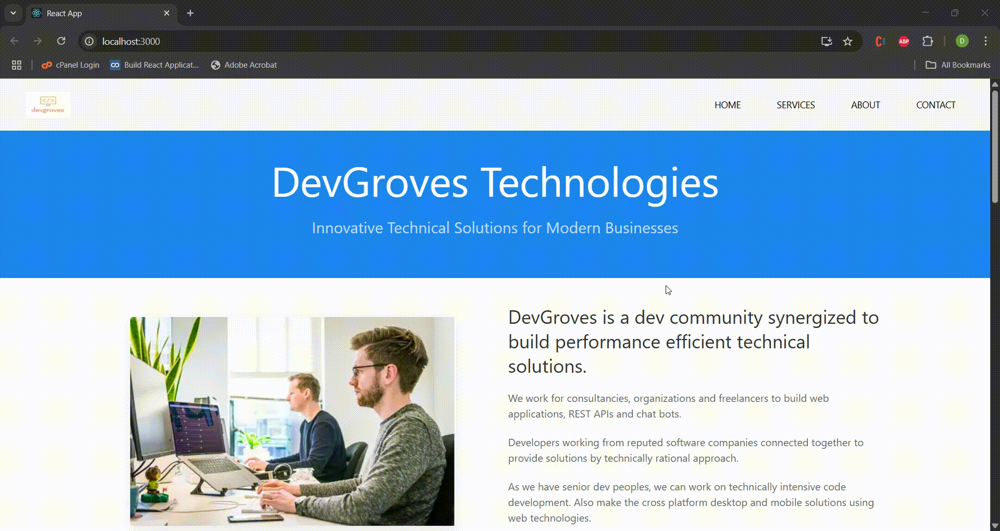

<h1 id="uikit---a-lightweight-and-modular-front-end-framework">UIKit - A Lightweight and Modular Front-End Framework</h1>

UIkit is a lightweight and modular front-end framework for developing fast and powerful web interfaces. 
It provides a comprehensive collection of HTML, CSS, and JS components that are simple to use, easy to customize, and extendable.

<h2 id="installation">Installation</h2>
<h3 id="via-npmyarn">Via npm/yarn</h3>
<pre><code class="language-bash"># Using npm
npm install uikit
# Using yarn
yarn add uikit

### include via CDN 
&lt;!-- CSS --&gt;
&lt;link rel=&quot;stylesheet&quot; href=&quot;https://cdn.jsdelivr.net/npm/uikit@3.16.0/dist/css/uikit.min.css&quot; /&gt;

&lt;!-- JS --&gt;
&lt;script src=&quot;https://cdn.jsdelivr.net/npm/uikit@3.16.0/dist/js/uikit.min.js&quot;&gt;&lt;/script&gt;
&lt;script src=&quot;https://cdn.jsdelivr.net/npm/uikit@3.16.0/dist/js/uikit-icons.min.js&quot;&gt;&lt;/script&gt;

### Download Manually

Download the latest version from UIkit&#39;s official website and include the files in your project.

## Quick Start

1.Include UIkit in your HTML file:
<!DOCTYPE html>
<html>
<head>
    <title>My UIkit Project</title>
    <link rel="stylesheet" href="css/uikit.min.css" />
</head>
<body>
    <h1 class="uk-heading-large">Hello UIkit!</h1>
    
    
    
</body>
</html>

2.Start using UIkit components:
<!-- Navigation -->
<nav class="uk-navbar-container" uk-navbar>
    

        <a class="uk-navbar-item uk-logo" href="#">Logo</a>
    

</nav>

<!-- Card Component -->

    <h3 class="uk-card-title">Card Title</h3>
    
Lorem ipsum dolor sit amet.

## License

UIkit is open source and released under the MIT License.

For complete documentation, visit https://getuikit.com/

### DevGroves technologies modalsite Highlights

Responsive Navbar using uk-navbar with mobile toggle

Card Components for portfolio items with hover animations

Custom Theme via SCSS variables

Lightbox Gallery for project showcases

Form Validation in contact section

### Learning Resources
This version:
1. Focuses purely on UIKit specifics
2. Provides multiple installation options
3. Highlights key implementation details
4. Explains the educational value
5. Links to official resources

Kept intentionally brief while covering all essentials about the framework and example.
down!
</code></pre>

## Demos

